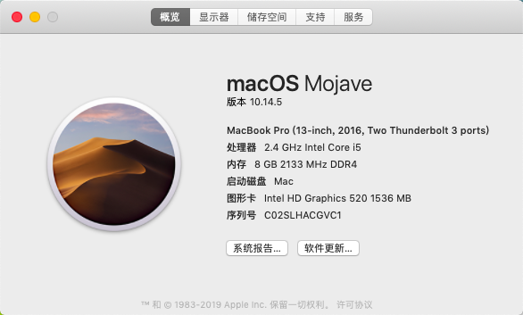

# ASUS A456U for macOS Mojave 10.14.5 Hackintosh
给自己旧笔记本安装了黑果尝鲜，体验还是可以的，分享一下EFI，造福相同型号的本本。  

## 配置
| 规格     | 详细信息                                       | 备注                             |
|----------|------------------------------------------------|----------------------------------|
| BIOS     | X456UV.300                                     |                                  |
| 操作系统 | macOS Mojave 10.14.5 (18E226)                  |                                  |
| CPU      | Intel Core i5-6200U, 2700 MHz  双核            |                                  |
| 显卡     | `Intel HD Graphics 520` / NVIDIA GeForce 920MX | `920MX` 无法驱动                 |
| 声卡     | Conexant SmartAudio HD (Conexant Unknown）     | 实际型号为 `CX8050` layout：`13` |
| 无线网卡 | Intel(R) Wireless-AC 9260                      | 原配为高通AR956x(AR9565)可以驱动 |
| 有线网卡 | Realtek RTL8111 PCI-E Gigabit Ethernet         |                                  |

## 说明

1. 完成度：**能用级别！**
2. 若安装 `Mojave 10.14.5` 请务必保证磁盘至少有 `25GB` 的空间。建议容量：尝鲜(40GB),长期使用(60GB+)。
3. 镜像来自 [黑果小兵](https://blog.daliansky.net/)，感谢大佬提供的镜像和十分硬核的教程。
4. 请安装完成 **后** 再进行EFI替换。
5. 部分可能用得到的工具已上传 [百度云]()。
6. 当遇到无法引导时请尝试使用 `config_init.plist` 进行引导。
> 如缺乏耐心**请勿升级**&折腾10.15.3(尝试多次无法引导)。

## 那些不能用
>当你能忍受某个事物所有缺点，那么她一定适合你。

### 1.独显显卡 `GeForce 920MX`
笔记本独显基本不能用。我也尝试过，铩羽而归。  
Mac本来就不是游戏用的，不支持显示，也不支持CUDA，驱动器来完全没用。

### 2.触控板(请务必外接USB/蓝牙鼠标！)
触控板为I2C HID 类型触控板。能驱动。   
但是操作逻辑十分反人类，已删除！！！
>想体验一下的可以自己添加 `VoodooI2CHID.kext` 😏

### ~~3.睿频/超频~~
~~该笔记本为我服务多年，年迈无力，未添加~~。 已添加睿频支持，节能真香！   
(事实上我的笔记本睿频会有烦人的电啸声🙃)

### ~~4.电量显示~~
~~电量显示只能显示 `0%` 和 `正在充电` 。故删除。~~  
已修复，电池磨损过高满载只能撑住20分钟……续航有兴趣的自己去测试吧

## 5. WIFI !
1. 由于网卡被我替换，持有该卡的朋友试验过 `IO80211FamilyV2.kext` 可以驱动，有需要的充分利用百度下载安装。  
2. 和我一样换了Intel无线网卡的同学那我只能恭喜你了，你找到了一个了一(shi)战(ji)成(nan)名(ti)的机会。  
目前已知 `AppleIntelWifiAdapt` 能支持无线，GitHub下载编译即可，但该项目基于`10.15` API 开发……  

附： `AppleIntelWiFiMVM` 支持列表(该项目2016年停止维护)
* Intel&reg; Wireless 3160
* Intel&reg; Wireless 3165
* Intel&reg; Wireless 4165
* Intel&reg; Wireless 7260
* Intel&reg; Wireless 7265
* Intel&reg; Wireless 8260
* NUC on-board wireless for NUC 5i\*RY\*
* NUC on-board wireless for NUC 6i\*SY\*

## 蓝牙问题
若蓝牙无法连接/搜索 请 **彻底关闭** Windows后(比如重启操作)再进入MacOS。

## 安装字体爆内存问题
这个我也不知道是不是BUG，安装5个ttc吃掉了24G内存。  
1. 尽量安装 `ttf` 格式的字体，`ttc` 字体集容易爆内存。
2. 不要批量安装字体集。
> 附赠：**请不要尝试使用任何方法让MacOS对NTFS进行读写！**，该操作可能会在造成NTFS卷损坏(譬如我装有ttc的移动硬盘)。

## VSCode问题
>虽然 `VS`和 `VScode` 的关系好比`Java`和`JavaScript`，雷锋和雷峰塔，但是它仍然继承了VS一样谜一般的BUG  

遇到过的问题有
1. 长时间后台有概率爆CPU(和VS一样重启就好)
2. 直接崩溃(不好意思你可能需要重装VSCode)

## 如有其他问题和建议可以在Issue告知我
