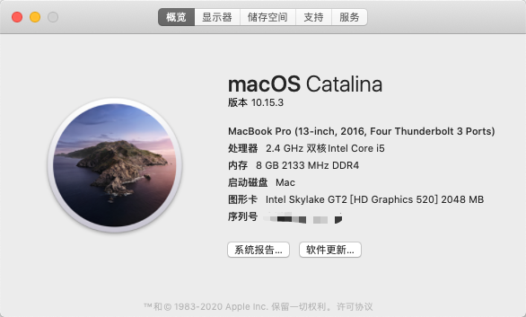

# ASUS A456U for macOS Hackintosh
给自己旧笔记本安装了黑果尝鲜，体验还是可以的，分享一下EFI，造福相同型号的本本。  

## 配置
| 规格     | 详细信息                                       | 备注                             |
|----------|------------------------------------------------|----------------------------------|
| BIOS     | X456UV.302                                     |                                  |
| 操作系统 | MacOS ~~Mojave 10.14.5 (18E226)~~              | 已升级至  `Catalina  10.15.4`    |
| CPU      | Intel Core i5-6200U, 2700 MHz  双核            |                                  |
| 显卡     | `Intel HD Graphics 520` / NVIDIA GeForce 920MX | `920MX` 无法驱动                 |
| 声卡     | Conexant SmartAudio HD (Conexant Unknown）     | 实际型号为 `CX8050` layout：`13` |
| 触控板   | I2C HID 设备(ELAN 1000)                        |                                  |
| 无线网卡 | Intel&reg; Wireless-AC 9260                    |                                  |
| 有线网卡 | Realtek RTL8111 PCI-E Gigabit Ethernet         |                                  |

## 说明

1. 完成度：大概、应该、也许、Maybe 90%。
2. 若安装 `Mojave 10.14.5` 请务必保证磁盘至少有 `25GB` 的空间。建议容量：尝鲜(40GB),长期使用(60GB+)。
3. 镜像来自 [黑果小兵](https://blog.daliansky.net/)，感谢大佬提供的镜像和十分硬核的教程。
4. 请安装完成 **后** 再进行EFI替换。
5. 部分可能用得到的工具已上传 [百度云](https://pan.baidu.com/s/10DGeGL3vFaZgCVVZD2OZRA) 
提取码：0kiv。
6. 当遇到无法引导时请尝试使用 `config_init.plist` 进行引导。
7. 请务必使用USB2.0口进行操作系统安装(包括Windows和Linux)
> 10.14**请勿直接升级**10.15.3。

## 哪些不能用？
>当你能忍受某个事物所有缺点，那么她一定适合你。

### 1.独显显卡 `GeForce 920MX`
笔记本N系1060以下的独显无法驱动，且BIOS无法屏蔽核显。    
>`920MX` 输出单元被屏蔽，也不支持`CUDA`，好像真的没用……

### 2.触控板(请务必外接USB/蓝牙鼠标！)
触控板为I2C HID 触控板。  
或许是DSDT没改对，截止目前为止仍只能工作在 `轮询模式` 下，有指针漂移Bug，彻底移除 `I2C` 驱动.
>想体验一下的可以自己添加 `VoodooI2C.kext` 和 `VoodooI2CHID.kext` 😏  
>爱折腾的提供[教程](https://www.penghubingzhou.cn/2019/07/24/VoodooI2C%20DSDT%20Edit%20FAQ/)一篇  
>clover和win下提取原版DSDT备份在`Other/origin`    

### ~~3.睿频~~
~~该笔记本为我服务多年，年迈无力，未添加~~。  
已添加睿频支持，节能真香！   
睿频范围(1.2 ~ 2.7 GHz)  
>事实上我的笔记本睿频会有烦人的电啸声🙃

### ~~4.电量显示~~
~~电量显示只能显示 `0%` 和 `正在充电` 。故删除。~~  
已修复，电池磨损过高满载只能撑住20分钟……续航有兴趣的自己去测试吧

## 5. WIFI !
1. 为了160MHz换掉了原配的网卡，持有该卡的朋友试验过 `IO80211FamilyV2.kext` 可以驱动，有需要的充分利用百度下载安装。  
2. 和我一样换了Intel无线网卡的同学那我只能恭喜你了，你找到了一个了一(shi)战(ji)成(nan)名(ti)的机会。  
~~目前已知 `AppleIntelWifiAdapt` 能支持无线，GitHub下载编译即可，但该项目基于`10.15` API 开发……~~  
实践证明 `AppleIntelWifiAdapt` 目前版本无法驱动 `Intel 9260`

附： `AppleIntelWiFiMVM` 支持列表(该项目2016年停止维护)
* Intel&reg; Wireless 3160
* Intel&reg; Wireless 3165
* Intel&reg; Wireless 4165
* Intel&reg; Wireless 7260
* Intel&reg; Wireless 7265
* Intel&reg; Wireless 8260
* NUC on-board wireless for NUC 5i\*RY\*
* NUC on-board wireless for NUC 6i\*SY\*

## 6.隔空投送
没有苹果设备，而且网卡貌似也不支持

## Intel蓝牙问题
`10.15` 以前的版本,若蓝牙无法连接/搜索 请从 Windows **热重启** 进入MacOS。  
`10.15` 之后的版本注入zxystd大佬的[IntelBluetoothFirmware](https://github.com/zxystd/IntelBluetoothFirmware/releases)解决
>尽量使用 `1.0.2` 版本,两个驱动一起注入。

## 安装字体爆内存问题
这个我也不知道是不是BUG，安装5个ttc吃掉了24G内存。  
1. 尽量安装 `ttf` 格式的字体，`ttc` 字体集容易爆内存。
2. 不要批量安装字体集。
> 附赠：**请不要尝试使用任何方法让MacOS对NTFS进行读写！**，该操作可能会在造成NTFS卷损坏(譬如我装有ttc的希捷BUP Slim)。

## 如有其他问题和建议可以在Issue告知我

国内的童鞋我同步了 [Coding](https://e.coding.net/zewenchenkmfoxm/ASUS_X456UV_Hackintosh_EFI.git)

# update for 10.15.3

## 相比10.14的变化
>基本没有变动，主要是修复驱动
1. ~~HDMI有声音了，虽然声音是笔记本声卡发出的……~~升级到 `10.15.4` 时候HDMI炸了，现在只能使用隔空播放……(**有投影需求的慎重请升级**)
2. ~~typeC 接口无法使用 USB3.0（也就是说只剩下一个 USB3.0 了……）~~
3. clover升级到了 `5107`
4. 注入了白果三码,**在修改三码之前请勿登录IMessage！**(该码来自互联网可能有大量人使用，封号别来找我)
5. 蓝牙再也不用从win重启了
6. FN按键可以使用了(亮度调节用不了)

## 使用建议
1. 不要在有重要资料的硬盘安装MacOS
2. 不要对NTFS执行**写**操作和密集的读取操作
3. 双系统建议建立独立 `exFAT` 分区，作为文件交换使用(本非酋 `NTFS for mac` 也翻车了，硬盘有价数据无价)